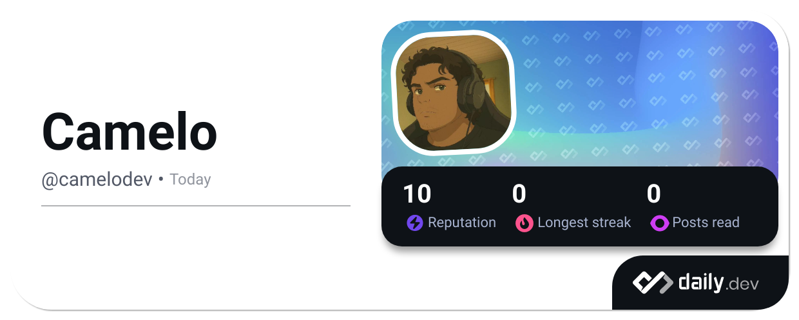

  

$$Life=\int\limits_{birth}^{death} {happiness \over time} \times \Delta time$$

‎‎ ‎ ‎ ‎ I am a **back-end software engineer** and **entrepreneur** who specializes in developing **scalable web, mobile, and enterprise solutions**. With a strong foundation in **MEAN stack**, **Java-based systems**, and **cloud-native development**, I thrive on solving complex problems and building high-performance software.

### 🚀 About Me
- 🔥 **Backend & Software Engineer** at **StargateIt** – Innovating **Appetito** to Restaurants
- 💻 **3+ hours of daily coding** – Focused on Backend, and Cloud computing
- 🔬 Passionate about **DevOps, and Large-Scale Management System**
- 🎯 Aiming to **achieve full financial independence** before **35** 🔥

<i>Check out my [Digital Garden](https://camelodev.tech/)</i>  

---
> ### ⚠️ Repository Order Notice
> I recently reorganized my repositories, which brought some older, beginner-friendly projects to the top.
These early-stage projects may lack features or contain minor bugs — but they’re a great starting point for learners or those who love to contribute!
> 
> 🔧 Contributions are warmly welcome – whether it’s fixing bugs, improving documentation, adding features, or doing code reviews.
> 
> You’ll also find more complex and production-grade projects throughout the repo list, suitable for intermediate and expert developers.
> 
> 🚀 Dive in, explore, and feel free to leave feedback, open issues, or raise pull requests. Let’s build together!
---

### 💡 Tech Stack

#### **🚀 Programming & Scripting:**

#### **🖥️ Frontend:**

#### **⚙️ Backend:**

#### **🗄️ Databases:**

#### **🌐 APIs:**

#### **☁️ DevOps & Cloud:**

#### **📊 AI & Data Science:**

#### **🗒️ Code Editor:**

#### **🤝 Other Tools:**

---

### ⚡ GitHub Stats

  <picture>
  <source media="(prefers-color-scheme: dark)" srcset="https://github-readme-stats.vercel.app/api?username=camelode&theme=radical&rank_icon=percentile&show_icons=true&show=prs_merged,reviews,prs_merged_percentage" />
  <source media="(prefers-color-scheme: light)" srcset="https://github-readme-stats.vercel.app/api?username=camelode&rank_icon=percentile&show_icons=true&show=reviews,prs_merged,prs_merged_percentage" />
  
  </picture>

  

  <picture>
  <source media="(prefers-color-scheme: dark)" srcset="https://github-readme-streak-stats.herokuapp.com?user=camelodev&theme=radical&date_format=M%20j%5B%2C%20Y%5D" />
  <source media="(prefers-color-scheme: light)" srcset="https://github-readme-streak-stats.herokuapp.com?user=camelodev&date_format=M%20j%5B%2C%20Y%5D" />
  
  </picture>

  <picture>
  <source media="(prefers-color-scheme: dark)" srcset="https://github-profile-summary-cards.vercel.app/api/cards/profile-details?username=camelodev&theme=radical" />
  <source media="(prefers-color-scheme: light)" srcset="https://github-profile-summary-cards.vercel.app/api/cards/profile-details?username=camelodev" />
  
  </picture>

  <picture>
  <source media="(prefers-color-scheme: dark)" srcset="http://github-profile-summary-cards.vercel.app/api/cards/repos-per-language?username=camelodev&theme=radical" />
  <source media="(prefers-color-scheme: light)" srcset="http://github-profile-summary-cards.vercel.app/api/cards/repos-per-language?username=camelodev" />
  
  </picture>

  <picture>
  <source media="(prefers-color-scheme: dark)" srcset="http://github-profile-summary-cards.vercel.app/api/cards/productive-time?username=camelodev&theme=radical&utcOffset=8" />
  <source media="(prefers-color-scheme: light)" srcset="http://github-profile-summary-cards.vercel.app/api/cards/productive-time?username=camelodev&utcOffset=8" />
  
  </picture>

---

### 🔥 What I'm Working On
- 🚀 Scaling **Stargate It** for enterprise clients
- 🤖 Developing **API management system to restaurants**
- ☁️ Enhancing **cloud-native deployment pipelines**

---

### 🌟 Highlighted Areas of Expertise
✔ **REST Product Development** – Built & scaled job board platforms, HRM systems, and resume builders.

✔ **Enterprise Applications** – POS systems and HRM platforms.

✔ **AI & Machine Learning** – Experience with data analysis, and large-scale prediction platforms.

✔ **DevOps & Cloud** – AWS, Linux, CI/CD pipelines, Docker (though not a fan 😆).

✔ **Game Development** – 2D games using JavaScript Canvas & Godot.

---

### ⚙️ My DevOps Workflow
- ✅ **Continuous Integration**: Automated builds using **GitHub**
- 🚀 **Continuous Deployment**: Dockerized microservices on **AWS**
- 📈 **Monitoring**: Using **Grafana and Zabbix** for system health

---

### 🔹 Why Connect With Me?
🚀 **I’m passionate about tech innovation, building scalable applications, and solving real-world problems.** Open to **collaborations, speaking opportunities, and mentorship.**

📫 **Let's connect:** [Linkedin](https://linkedin.com/in/victor-jayme)
| [Portfolio](https://camelodev.tech)

---

### 📊 Profile Insights

---

  
🦑 Github Metrics 🌌

  <table>
    <tr>
      <td>
        
        
      </td>
      <td>
        
        
      </td>
    </tr>
  </table>

### 👨‍💻 Find me on communities

  <a href="https://stackoverflow.com/users/30196412/camelodev">
<code></code>
</a>
  <a href="https://gitlab.com/camelodev">
<code></code>
</a>
  <a href="https://github.com/camelodev">
<code></code>
</a>
  <a href="https://app.daily.dev/camelodev">
<code></code>
</a>
  <a href="https://profile.codersrank.io/user/camelodev/">
<code></code>
</a>

---

### 🌌 3D Contribution metrics(latest)

<picture>
  <source media="(prefers-color-scheme: dark)" srcset="https://raw.githubusercontent.com/camelodev/camelodev/main/profile-3d-contrib/profile-night-rainbow.svg" />
  <source media="(prefers-color-scheme: light)" srcset="https://raw.githubusercontent.com/camelodev/camelodev/main/profile-3d-contrib/profile-south-season-animate.svg" />
  
</picture>

---

### 📃 Gists may you important

  <a href="https://gist.github.com/camelodev/8faf5592f24a45ff1151378f0fb40309/">
    <picture>
    <source media="(prefers-color-scheme: dark)" srcset="https://github-readme-stats.vercel.app/api/pin/?username=camelodev&repo=api-rest-agropecuaria&theme=radical" />
    <source media="(prefers-color-scheme: light)" srcset="https://github-readme-stats.vercel.app/api/pin/?username=camelodev&repo=api-rest-agropecuaria" />
    
    </picture>
  </a>
  <a href="https://gist.github.com/camelodev/bd2d807c9f436b755fa81eafc6b9d1d4/">
    <picture>
    <source media="(prefers-color-scheme: dark)" srcset="https://github-readme-stats.vercel.app/api/pin/?username=camelodev&repo=cpp-scanner&theme=radical" />
    <source media="(prefers-color-scheme: light)" srcset="https://github-readme-stats.vercel.app/api/pin/?username=camelodev&repo=cpp-scanner" />
    
    </picture>
  </a>

---

### 🏆 Github Trophies

  <a href="https://github.com/camelodev">
    <picture>
    <source media="(prefers-color-scheme: dark)" srcset="https://github-trophies.vercel.app/?username=camelodev&theme=radical&no-frame=true" />
    <source media="(prefers-color-scheme: light)" srcset="https://github-trophies.vercel.app/?username=camelodev&no-frame=true" />
    
    </picture>
  </a>

### 📈 Monthly Contribution Stats

<a href="https://github.com/camelodev">
<picture>
  <source media="(prefers-color-scheme: dark)" srcset="https://github-readme-activity-graph.vercel.app/graph?username=camelodev&theme=react-dark&radius=8&area=true" />
  <source media="(prefers-color-scheme: light)" srcset="https://github-readme-activity-graph.vercel.app/graph?username=camelodev&radius=8&area=true" />
  
</picture>
</a>

---

  
Activities on other dev platforms😉

<h3 align="center">Leetcode</h3>

  <a href="https://leetcode.com/u/camelodev/">
<picture>
  <source media="(prefers-color-scheme: dark)" srcset="https://leetcard.jacoblin.cool/camelodev?theme=radical&font=Basic&ext=heatmap" />
  <source media="(prefers-color-scheme: light)" srcset="https://leetcard.jacoblin.cool/camelodev?theme=light&font=Basic&ext=heatmap" />
  
</picture>
</a>

<h3 align="center">Coading Activity</h3>

| Coders Rank                                                                                                                                                                                                                                                                                                                                                                                                                          |                                                                                                                                                                                                                                                                                                                                                                                                 Wakatime |
|:-------------------------------------------------------------------------------------------------------------------------------------------------------------------------------------------------------------------------------------------------------------------------------------------------------------------------------------------------------------------------------------------------------------------------------------|---------------------------------------------------------------------------------------------------------------------------------------------------------------------------------------------------------------------------------------------------------------------------------------------------------------------------------------------------------------------------------------------------------:|
| <a href="https://profile.codersrank.io/user/camelodev"><picture><source media="(prefers-color-scheme: dark)" srcset="https://cr-skills-chart-widget.azurewebsites.net/api/api?username=camelodev&bg=4b505d" /><source media="(prefers-color-scheme: light)" srcset="https://cr-skills-chart-widget.azurewebsites.net/api/api?username=camelodev&bg=fff" /></picture></a> | <a href="https://wakatime.com/@camelodev"><picture><source media="(prefers-color-scheme: light)" srcset="https://wakatime.com/share/@camelodev/3d538d55-7c79-415d-883e-012b3af215c2.svg" /><source media="(prefers-color-scheme: dark)" srcset="https://wakatime.com/share/@camelodev/2af16973-3c65-457d-ae79-ca2d0e0e80d5.svg" /></picture></a> |

  
  

<picture>
  <source media="(prefers-color-scheme: dark)" srcset="https://github.com/camelodev/camelodev/blob/output/github-contribution-grid-snake-dark.svg" />
  <source media="(prefers-color-scheme: light)" srcset="https://github.com/camelodev/camelodev/blob/output/github-contribution-grid-snake.svg" />
  
</picture>

---

Workflow status⚙

  

🔥 **Let's build something awesome together!**

